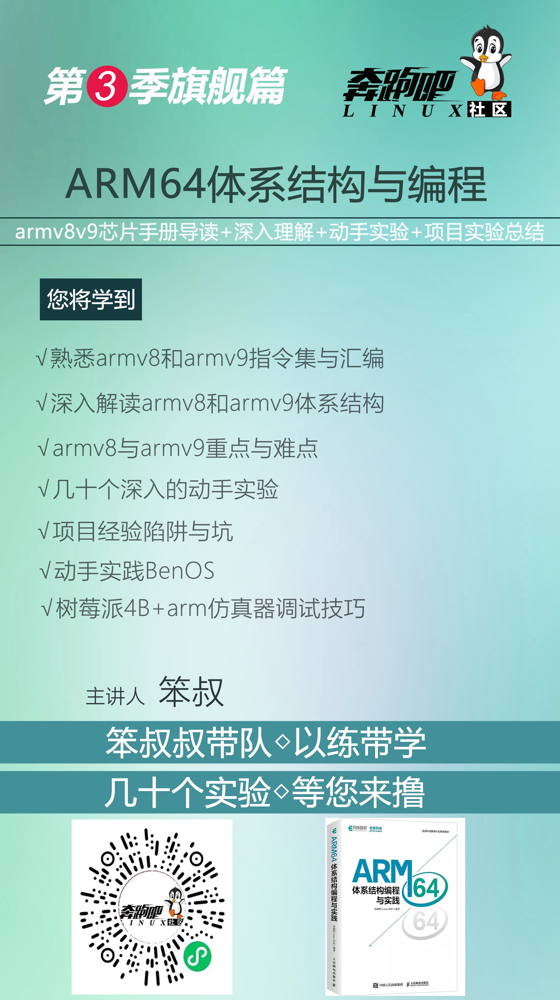
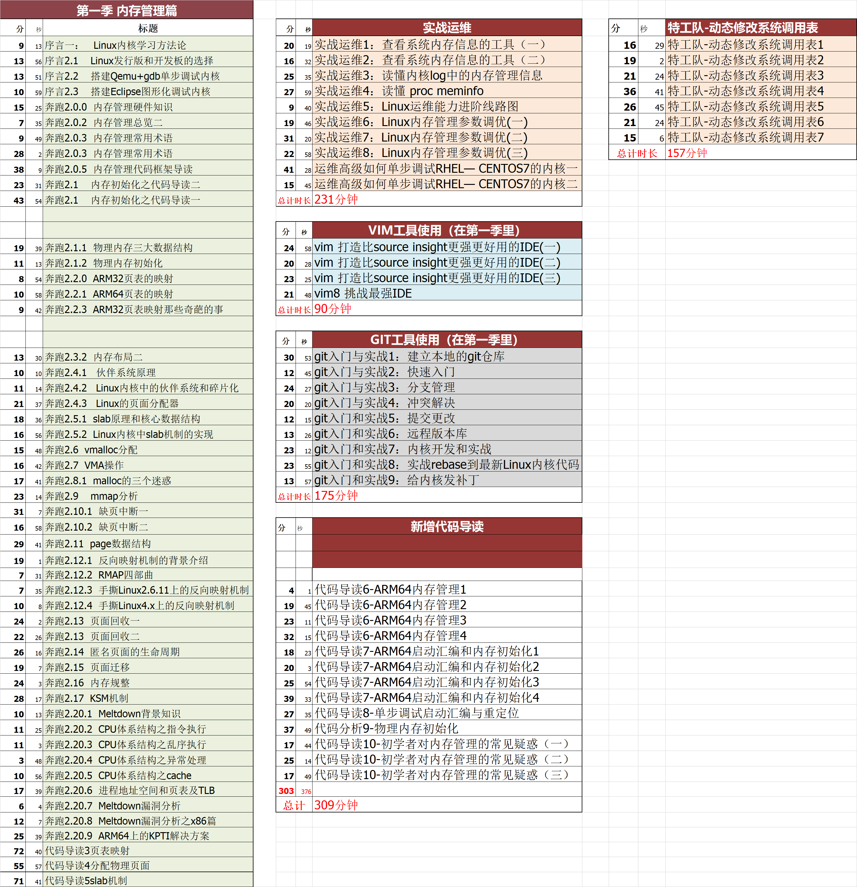
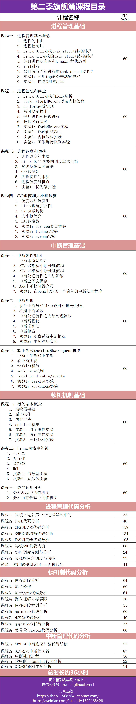
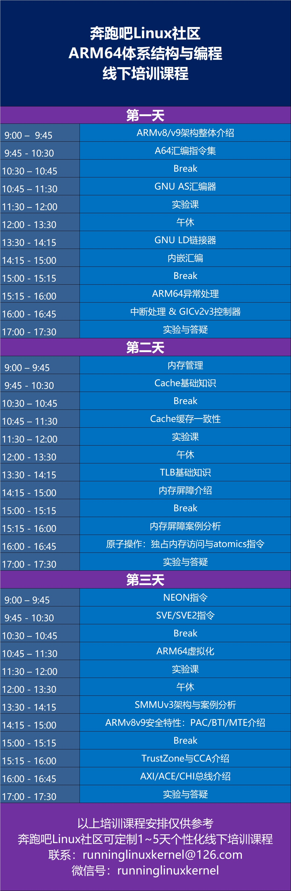

# 新书《ARM64体系结构：编程与实践》

在芯片被卡脖子，国产芯片大发展的背景下，不了解和熟悉ARM64体系结构会被时代浪潮抛弃！

Arm China教育计划推荐教材，全球首本ARMv8v9体系结构的新书《ARM64体系结构：编程与实践》.

本书由奔跑吧 Linux 社区策划，由国内众多社区小伙伴和工程师采用
社区合作的方式共同完成，参与编写本书的人有魏汉武、寇朝阳、王乐、王晓华、蔡琛、余云波、
牛立群、代祥军、何花、徐国栋、徐彦飞、郑律、张馨雨、 Xiao Guangrong、 Gavin Guo、 
Horry Zheng、 Cherry Chen、 Peter Chen、贾献华等。

面对10000多页晦涩难懂的英文ARMv8v9手册，你是否感到无奈，无语，无聊，困惑，烦躁，寂寞，
头皮发麻，不知所云。有这种感觉就对了！

这是全球首本使用 ***接地气语言+动手实践*** 的方式来给你讲解ARMv8v9架构，解决你的无奈和寂寞。

# 实验参考代码说明

本实验参考代码是《ARM64体系结构：编程与实践》一书的参考代码，仅供读者做实验参考使用。

本参考代码只提供 ***部分实验的参考代码*** ，剩余部分实验留给读者独立完成。

***关于每个实验，我们在奔跑吧Linux社区的第三季视频课程中有详细的讲解和分析。***     
有需要的读者可以通过淘宝店或者微店进行订阅。文字不如声音，声音不如视频。视频课程会比图书讲的更深入和详细！

本仓库的另外一个镜像地址：
https://gitee.com/benshushu/arm64_programming_practice

# 实验平台与实验环境说明

本书的所有实验都可以在如下任意一个实验平台上完成:    
1）树莓派4B开发板 (需要读者自行购买树莓派4b开发板等配套硬件)  
2）使用定制版QEMU来模拟树莓派4B (推荐使用我们提供的VMware/VirtualBox镜像)   
读者可以根据实际情况来选择。

注意：本书部分实验（例如第22和第23章的实验）可以在基于QEMU+ARM64 Linux系统上实现，可以访问如下仓库：    
https://github.com/runninglinuxkernel/runninglinuxkernel_5.0

我们推荐使用我们提供的VMware/VirtualBox镜像，下载方式：关注“奔跑吧Linux社区”微信公众号，输入“arm64”获取下载地址。   
配置如下：
1. 主机硬件平台：Intel x86_64处理器兼容主机。
2. 主机操作系统：Ubuntu Linux 20.04。
3. GCC版本：9.3（aarch64-linux-gnu-gcc）。
4. QEMU版本，定制版的QEMU。  

# 本书特色：
1. 讲解最新的ARMv8和v9架构
2. 理论和实践兼顾
3. 突出动手实践，几十个有趣和有深度实验
4. 基于树莓派4B和QEMU为实验平台
5. 总结常见陷阱与项目经验

# 配套资料下载

1. QEMU实验平台 - VMware/VirtualBox镜像
2. 实验参考代码
3. 免费&试看视频
4. 本书涉及的芯片资料 (包括笨叔注释版的ARMv8架构手册)  

关注“奔跑吧Linux社区”微信公众号，输入“arm64”获取下载地址。

# 视频课程
配套视频课程由奔跑吧Linux社区录制完成。   
购买地址：     
https://shop115683645.taobao.com/   
https://weidian.com/?userid=1692165428   

1. 第3季课程海报

2. 第3季课程目录

3. 第1季课程目录

4. 第2季课程目录

5. 线下布道与培训

奔跑吧Linux社区可以为广大企业提供线下线上培训与布道，提供两大部分的课程内容：
1. ARM64（ARMv8和v9架构）体系结构与编程  
2. RISC-V体系结构与编程  
3. Linux内核/驱动开发与调试  

讲师：奔跑吧Linux社区金牌讲师  
有兴趣的可以联系：runninglinuxkernel@126.com    
或者微信号: runninglinuxkernel   
